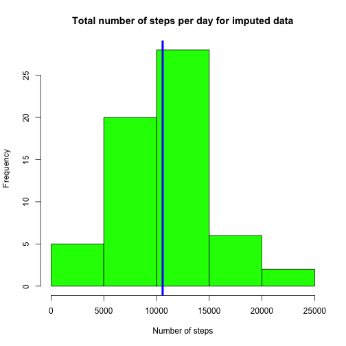
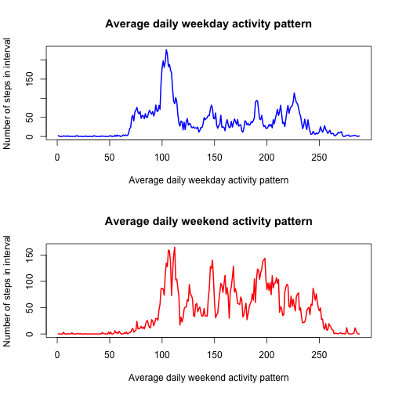

# Reproducible Research: Peer Assessment 1


## Loading and preprocessing the data
Unzip and read the activity data in one step

```r
steps_data <- read.csv(unz('activity.zip', 'activity.csv'))
steps_data_measured <- steps_data[(!is.na(steps_data$steps)),]
# remove the missing factor levels for the subset of the data
steps_data_measured$date <- factor(steps_data_measured$date)
```

# Make a histogram of the total number of steps taken each days

```r
steps_per_day <- tapply(steps_data_measured$steps, steps_data_measured$date, sum)
hist(steps_per_day, col='green', main= 'Total number of steps per day', xlab='Number of steps')
abline(v=mean(steps_per_day), lwd=4, col='blue')
```

 

## What is mean total number of steps taken per day?
The **mean** for the number of steps (shown on the histogram above as a blue line) is equal to 10766.19 and the **median** is equal to 10765

## What is the average daily activity pattern?

```r
steps_data_na_as_zeros <- steps_data
steps_data_na_as_zeros[is.na(steps_data_na_as_zeros), 1] <- 0
steps_data_avg_day <- tapply(steps_data_na_as_zeros$steps, steps_data_na_as_zeros$interval, mean)
plot(steps_data_avg_day, type='l', col='blue', lwd=2, main='Average daily activity pattern',
     xlab='Average daily activity pattern', ylab='Number of steps in interval')
```

 

The 5-minute interval which contains the maximum number of steps on average is interval with value 835 with the average of 179.13 steps. 
The index of this interval is 104 which is visible as the biggest peak on the graph above.
    
## Imputing missing values 
The total number of missing values in the data set is: 2304
 

```r
# Fill in missing steps values as the mean for that 5-minute interval over all days
steps_data_na_as_means <- steps_data
for (i in 1:nrow(steps_data_na_as_means)) {
    if(is.na(steps_data_na_as_means[i, 1])) {
        steps_data_na_as_means[i, 1] <- steps_data_avg_day[[as.character(steps_data_na_as_means[i, 3])]]
    }
}

steps_per_day_imputed <- tapply(steps_data_na_as_means$steps, steps_data_na_as_means$date, sum)
hist(steps_per_day_imputed, col='green', main= 'Total number of steps per day for imputed data', xlab='Number of steps')
abline(v=mean(steps_per_day_imputed), lwd=4, col='blue')
```

 

The **mean** for the number of steps (shown on the histogram above as a blue line) is equal to 10581.01 and the **median** is equal to 10395
Both values are around 2.5% lower than the mean and median for original data set where missing values where treated as zeros.
The general impact of imputing missing data on the estimates is not large but results in a visible smoothing of the histogram.
The most numerous bucket in histogram is now less outstanding compared to others. 

## Are there differences in activity patterns between weekdays and weekends?

```r
day_type <- function(x) {if(weekdays(as.Date(x))=="Sunday" || weekdays(as.Date(x))=="Saturday") "weekend" else "weekday"}
# Create new day_type column containing the value "weekend" or "weekday"
steps_data_na_as_means$day_type <- factor(sapply(steps_data_na_as_means$date, day_type))
weekdays_and_weekend_data <- split(steps_data_na_as_means, steps_data_na_as_means$day_type)
weekdays_data <- weekdays_and_weekend_data[[1]]
weekend_data <- weekdays_and_weekend_data[[2]]

weekdays_data_avg_day <- tapply(weekdays_data$steps, weekdays_data$interval, mean)
weekend_data_avg_day <- tapply(weekend_data$steps, weekend_data$interval, mean)
par(mfcol = c(2, 1))   
plot(weekdays_data_avg_day, type='l', col='blue', lwd=2, main='Average daily weekday activity pattern',
     xlab='Average daily weekday activity pattern', ylab='Number of steps in interval')
plot(weekend_data_avg_day, type='l', col='red', lwd=2, main='Average daily weekend activity pattern',
     xlab='Average daily weekend activity pattern', ylab='Number of steps in interval')
```

 

Based on the graphs and computations above we can conclude that:
- activity on weekends is higher than during weekdays, average total number of steps in a weekend day is 12025.03 and during weekdays it is 10067.59    
- activity spike on weekends starts around an hour later than on weekends, probably because people sleep longer then 
- there is a visible spike of activity on weekdays occuring in the morning and aftenoon, probably corresponding to before and after work activity. The activity times on weekends are more random with no period standing out as much. 
