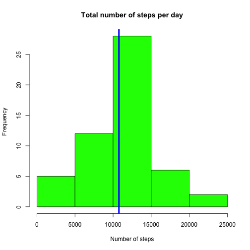
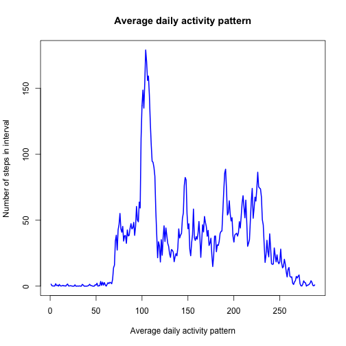

# Reproducible Research: Peer Assessment 1


## Loading and preprocessing the data
Unzip and read the activity data in one step

```r
steps_data <- read.csv(unz('activity.zip', 'activity.csv'))
steps_data_measured <- steps_data[(!is.na(steps_data$steps)),]
# remove the missing factor levels for the subset of the data
steps_data_measured$date <- factor(steps_data_measured$date)
```

# Make a histogram of the total number of steps taken each days

```r
steps_per_day <- tapply(steps_data_measured$steps, steps_data_measured$date, sum)
hist(steps_per_day, col='green', main= 'Total number of steps per day', xlab='Number of steps')
abline(v=mean(steps_per_day), lwd=4, col='blue')
```

 

## What is mean total number of steps taken per day?
The **mean** for the number of steps (shown on the histogram above as a blue line) is equal to 10766.19 and the **median** is equal to 10765

## What is the average daily activity pattern?

```r
steps_data_na_as_zeros <- steps_data
steps_data_na_as_zeros[is.na(steps_data_na_as_zeros), 1] <- 0
steps_data_avg_day <- tapply(steps_data_na_as_zeros$steps, steps_data_na_as_zeros$interval, mean)
plot(steps_data_avg_day, type='l', col='blue', lwd=2, main='Average daily activity pattern',
     xlab='Average daily activity pattern', ylab='Number of steps in interval')
```

 

## Imputing missing values
The total number of missing values in the data set is: 2304


```r
# Fill in missing steps values as the mean for that 5-minute interval over all days
steps_data_na_as_means <- steps_data
for (i in 1:nrow(steps_data)) {
    if(is.na(steps_data_na_as_means[i, 1])) {
        steps_data_na_as_means[i, 1] <- steps_data_avg_day[[as.character(steps_data_na_as_means[i, 3])]]
    }
}
```


## Are there differences in activity patterns between weekdays and weekends?
